= Graph adventures with wine
:toc:
:toc-title: Weeks so far
:toclevels: 1

.by Maja Petric
[caption="Grapes  ",link=https://unsplash.com/photos/vGQ49l9I4EE] 
image::https://images.unsplash.com/photo-1423483641154-5411ec9c0ddf?ixlib=rb-1.2.1&ixid=eyJhcHBfaWQiOjEyMDd9&auto=format&fit=crop&w=1950&q=80[width=640, align="center"] 

Based on the data from https://www.kaggle.com/zynicide/wine-reviews/data[Kaggle], this repository will hold all models, thoughts, questions and code as we explore this data set on a weekly basis.

Follow along on the https://twitch.tv/neo4j_[Neo4j Twitch channel]!

[#week1]
=== Week 1 (18 May): Let's explore the data!
_Want to participate?_

* _https://www.youtube.com/watch?v=J7WHEnA-Ygg[Watch the Twitch session^]_
* _http://www.apcjones.com/arrows/#[Link to Arrows for data modelling^]_
* _https://www.kaggle.com/zynicide/wine-reviews/data[Link to the original data set^]_

So this was an exciting start to the week! Having only just found the wine data set not that much before the start of the Twitch session, it certainly was a voyage of discovery. In this session we:

* Had a look at the data set, thinking about some of the questions we might ask and insight we could discover
* Had an initial think about what might the data model look like, and some of the modelling decisions we're going to have to make over the coming weeks
* Decided upon pairing down the data set for now, and start thinking about importing that data

*Exploring the data*

First of all, let's take a sample peak at the data:
|===
|id |country |description |designation |points |price |province |region_1 |region_2 |taster_name |taster_twitter_handle |title |variety |winery 

|0
|Italy
|Aromas include tropical fruit, broom <...>
|Vulkà Bianco
|87
|
|Sicily & Sardinia
|Etna
|
|Kerin O’Keefe
|@kerinokeefe
|Nicosia 2013 Vulkà Bianco  (Etna)
|White Blend
|Nicosia

|1
|Portugal
|This is ripe and fruity,  <...>	
|Avidagos
|87
|15
|Douro
|
|
|Roger Voss
|@vossroger
|Quinta dos Avidagos 2011 Avidagos Red (Douro)
|Portuguese Red
|Quinta dos Avidagos

|2
|US
|Tart and snappy, the flavors of lime  <...>
|
|87
|14
|Oregon
|Willamette Valley
|Willamette Valley
|Paul Gregutt
|@paulgwineÂ
|Rainstorm 2013 Pinot Gris (Willamette Valley)
|Pinot Gris
|Rainstorm
|===

We'll probably find having a definition of the headers helpful for some of the less obvious fields!

[cols="1,4",width="75%"]
|===
|Header | Description

|<id>
|The row id of the data set

|country 
|The country that the wine is from

|description 
|Description used to describe the tasting features of the wine

|designation 
|The vineyard within the winery where the grapes that made the wine are from. A winery may have more than one vineyard

|points 
|The number of points WineEnthusiast rated the wine on a scale of 1-100

|price 
|The cost for a bottle of the wine

|province 
|The province or state that the wine is from

|region_1 
|The wine growing area in a province or state (ie Napa Valley)

|region_2 
|Sometimes there are more specific regions specified within a wine growing area (ie Rutherford inside the Napa Valley)

|taster_name 
|Name of the taster

|taster_twitter_handle 
|Taster's twitter handle

|title 
|The title of the wine review, which often contains the vintage if you're interested in extracting that feature

|variety 
|The type of grapes used to make the wine (ie Pinot Noir)

|winery 
|The winery that made the wine
|===

A very interesting data set indeed. There are some rather cool things that we can explore, such as:

* Do tasters stick to certain wines, or do they go across different grape varieties/countries?
* How do points compare to price?
* How do varities cross countries?
* We can tokenise the description - can we recommend wines based on description elements?
* ...and so many more!

*Data set challenges*

As we explored this data, a number of questions arose: 

* Could we safely make the assumption that each line represented a unique wine? Or were we looking at a wine with multiple entries becauses different reviewers reviewed it?
* Were there data duplications?
* What's the year of the wine?
* and so forth

We decided to have a quick look at the data using MS Excel. We discovered some things about the data:

* there is only one wine per reviewer, so we're not dealing with multiple reviews per wine
* there are indeed duplications in the wine, we need to resolve those
* we are going to need to do some work on the wine name - we'll need to extract the year, and also we'll want to keep the title as a wine can be across many years

As an outcome of the session, I will revise the data and removed the duplicates in the dataset. Note that we could have done this within Neo4j, but I am always a fan of cleaning the data prior to a load if it is straightforward to do so!

*Modelling*

We then turned our thoughts to modelling. Using http://www.apcjones.com/arrows[Arrows^], we took a first pass at taking all of the data elements available, and then assigning them as either node labels, relationship types, or properties on either. The first pass looked like this:

.The initial pass - getting the data down on paper!
image::img\model1.jpg[]

Whilst this is far from the finished article, this initial pass allows us to start thinking about what questions we were looking to answer, and based on that, how would we change this model. There will be other things we'll need to think about resolving too, such as:

* How are we going to manage `Province` -> `Region1` -> `Region2`? Not all wines have all those details
* How are we going to represent `Wine` (of which the title contains name wine + year), and then the `WineTitle` and it's respective `Year`?
* We've also got `Designation` to add! Where's that going?

We will visit all of these questions, and more, as we continue our wine adventure!

*Importing the data*

For now, we've got a cut-down model we're going to import (we'll import the rest in the next session!), which is the following

.Model based on partial data - slightly less contravertial!
image::img\model2.jpg[]

Based on the approaches we use below, we are dealing with some of the duplicate values for now.

*Setting indexes*

As we would expect `Winery` and `Country` to be unique names, we are going to be setting some indexes to allow use to `MERGE` as we load the new data. `MERGE` behaves like a `CREATE` if the data doesn't already exist, and a `MATCH` if it does. You can read more about `MERGE` in https://neo4j.com/docs/cypher-manual/current/clauses/merge/[the documentation^].

For now, we're going to assume that `Province` is also unique, and we'll set an index on a property for that too. Not the end of the world we've we're wrong - we'll just correct the data later. All part of the journey.

I suggest you enable https://neo4j.com/developer/neo4j-browser/#browser-tips[multi statement query editor^] in browser as we start to do multiple queries in a row!

To set the indexes, run the following in Neo4j Browser:

----
CREATE INDEX ON :Winery(name);
CREATE INDEX ON :Province(name);
CREATE INDEX ON :Country(name);
----

*Dealing with null values*

So we discovered some null values in our data! We have some decisions to make. Do we want to skip values if they have a null, or do we want to set a default value? For the purposes of Country, Province and Winery, we are going to want to set some sort of value. Either we can later on extrapolate the information and correct it, or we are getting useful information by knowing it does not exist. So for this scenario we are going to stick with 'No Country', 'No Province' and 'No Winery' as our default options.

There are a number of ways we can deal with null values, and in this instance, I'm going to use the `FOREACH - IN CASE WHEN` trick. We are going to be combining `FOREACH` to allow us to do a `MERGE`, and `CASE` to check for nulls and set a default. I'm still looking for any content talking about this trick, and I'll update this document when I find it!

Loading the nodes and relationships can be memory hungry, so I am going to load the data in two passes. First of all, let's load all the nodes:
----
:auto //add this line if you're using Neo4j Browser
USING PERIODIC COMMIT 1000
LOAD CSV WITH HEADERS FROM 'https://raw.githubusercontent.com/lju-lazarevic/wine/master/data/winemag-data-130k-v3.csv' AS row
FOREACH (i IN 
    CASE WHEN row.country IS NOT NULL 
         THEN [row.country] 
         ELSE ["No Country"] 
    END | MERGE (c:Country {name:i}))
FOREACH (i IN 
    CASE WHEN row.province IS NOT NULL 
         THEN [row.province] 
         ELSE ["No Province"] 
    END | MERGE (p:Province {name:i}))
FOREACH (i IN 
    CASE WHEN row.winery IS NOT NULL 
         THEN [row.winery] 
         ELSE ["No Winery"] 
    END | MERGE (w:Winery {name:i}))
----

Now we need to add the relationships between country, province and winery. I'm sure there's a prettier way to do this, which I will update when I think of it! For now, we also need to think about those null values again when we're doing the second pass:
----
:auto //add this line if you're using Neo4j Browser
USING PERIODIC COMMIT 1000
//:auto
//USING PERIODIC COMMIT 1000
LOAD CSV WITH HEADERS FROM 'https://raw.githubusercontent.com/lju-lazarevic/wine/master/data/winemag-data-130k-v3.csv' AS row
WITH 
    CASE row.country 
        WHEN null 
        THEN "No Country" 
        ELSE row.country 
    END AS country,
    CASE row.province 
        WHEN null 
        THEN "No Province" 
        ELSE row.province 
    END AS province, 
    CASE row.winery 
        WHEN null 
        THEN "No Winery" 
        ELSE row.winery 
    END AS winery
MATCH (c:Country {name:country}), 
    (p:Province {name:province}), 
    (w:Winery {name:winery})
MERGE (w)-[:FROM_PROVENCE]->(p)
WITH p,c
MERGE (p)-[:PROVINCE_COUNTRY]->(c)
----

And that's the data in! As we've been using `MERGE`, that will take care of any duplicate values, so we don't need to worry about those.

*What next?*

Phew! So we've got some data in. I'll leave it to you, dear reader, to think what questions you might ask of the data. I'll suggest the following to get you started, and we'll cover them in the next session:

* Which countries have the most wineries?
* Are there any wineries across different countries?
* Which wineries are across multiple provinces?

I would love to hear what interesting discoveries you have also found. Let me know during the session!

See you on the 1st June!

[#week2]
=== Week 2 (30 May - 9am PDT, 12pm EDT, 5pm BST, 6pm CEST): Importing the data, asking some questions, revising our data model

.by Tim Mossholder
[caption="Vineyard and Hills  ",link=https://unsplash.com/photos/KDlLiCL7XPk, align="center"] 
image::https://images.unsplash.com/photo-1464036388609-747537735eab?ixlib=rb-1.2.1&ixid=eyJhcHBfaWQiOjEyMDd9&auto=format&fit=crop&w=1950&q=80[width=640, align="center"] 

https://twitch.tv/neo4j_[Neo4j on Twitch!^]

_Want to participate?_

* _https://www.youtube.com/watch?v=__iDEan55Xw[Watch the Twitch session part 1^]_
*_https://www.youtube.com/watch?v=KmCRpCp25qM[Watch the Twitch session part 2 - conneciton dropped^]_
* _Download and install http://neo4j.com/download[Neo4j Desktop^]_
* _Create a new project in Neo4j Desktop called wine, and add a database. You may find https://neo4j.com/developer/neo4j-desktop/[this developer guide^] helpful_
* _Complete the steps for Week 1 to load the data_

Can't make the session? Not to worry, the recording will be on the https://youtube.com/neo4j[Neo4j YouTube channel^] soon after.

This week was an interesting installment! We spent the first part of the session walking through the rationale behind the load queries for the data. As you may recall we had some duplicates to deal with, so we made some decisions, such as assuming that all wineries and provinces has unique names, and we imported the data.

I also posed some questions to you all to ask of this data, as a reminder, the questions were:

* Which countries have the most wineries?
* Are there any wineries across different countries?
* Which wineries are across multiple provinces?

As well as using Cypher to answer the questions, we also had a brief look at the data using Neo4j Bloom. For those of you who have not come across Bloom before, it's a near natural language visualisation tool for graphs. You can read more about it https://medium.com/neo4j/bloom-ing-marvellous-a2be0c3702bb[here^].

So, onto those queries!

.Which countries have the most wineries?
----
MATCH path=(w:Winery)-[:FROM_PROVENCE]->(p:Province)-[:PROVINCE_COUNTRY]->(c:Country)
RETURN c.name AS Country, count(DISTINCT w) AS Total 
ORDER BY Total DESC
----

.Which wineries are across multiple provinces?
----
MATCH (w:Winery)-[:FROM_PROVENCE]->(p:Province)
WITH w, COLLECT(p.name) AS Provinces, count(p) AS Total
RETURN w.name AS Winery, Provinces, Total 
ORDER BY Total DESC
----

So, having had a look at that data, we then decided to add more data. Again, we're going to leave the sticky matter of how to deal with regions for now. We decided we'd add `Taster`, `Designation` and `Variety`, as well as the `Wine` itself. If you recall, `Wine` name also contained the year - and we'll probably want to extract that. But for now, we'll import it as is.

.The expanded data model that now includes Designation, Taster, Wine and Variety
image::img\model3.jpg[]

First of all, we need to set some indexes. We do this because this will allow us to search for data faster by using an index look up on properties of interest rather than doing a full database scan. It's also super helpful if we're using `MERGE`, again for the same reason.

.Set the required indexes
----
//indexes for additional data
CREATE INDEX ON :Wine(id);
CREATE INDEX ON :Taster(name);
CREATE INDEX ON :Variety(name);
CREATE INDEX ON :Designation(name);
----

And now we can load the data. As before, we will do two passes of this, one to create the nodes, and then the second pass to create the relationships. You will notice in the second pass we also search for the `Winery` node - this is so that we can connect it up to `Wine`!

.Loading the `Designation`, `Taster`, `Variety` and `Wine` nodes. Note that we use `CREATE` for `Wine` - that's because we expect all instances to be unique, so we can just create them
----
:auto //add this line if you're using Neo4j Browser
USING PERIODIC COMMIT 1000
LOAD CSV WITH HEADERS FROM 'https://raw.githubusercontent.com/lju-lazarevic/wine/master/data/winemag-data-130k-v3.csv' AS row
FOREACH (i IN
    CASE WHEN row.designation IS NOT NULL
         THEN [row.designation]
         ELSE ["No Designation"]
    END | MERGE (d:Designation {name:i}))
FOREACH (i IN
    CASE WHEN row.taster_name IS NOT NULL
         THEN [row.taster_name]
         ELSE ["No Taster"]
    END | MERGE (t:Taster {name:i}))
FOREACH (i IN
    CASE WHEN row.variety IS NOT NULL
         THEN [row.variety]
         ELSE ["No Variety"]
    END | MERGE (v:Variety {name:i}))
CREATE (w:Wine {id:row.id, title:row.title})
----

.And following up with creating the relationships. You will notice all of the relationship types are `CREATE`, this is because they all join onto `Wine`, which as we said previously, we assume to be unique for all entries.
----
:auto //add this line if you're using Neo4j Browser
USING PERIODIC COMMIT 1000
LOAD CSV WITH HEADERS FROM 'https://raw.githubusercontent.com/lju-lazarevic/wine/master/data/winemag-data-130k-v3.csv' AS row
WITH
    CASE row.designation
        WHEN null
        THEN "No Designation"
        ELSE row.designation
    END AS designation,
    CASE row.taster_name 
        WHEN null
        THEN "No Taster"
        ELSE row.taster_name 
    END AS taster,
    CASE row.variety
        WHEN null
        THEN "No Variety"
        ELSE row.variety
    END AS variety,
    CASE row.winery
        WHEN null
        THEN "No Winery"
        ELSE row.winery
    END AS winery,
    row.id as id
MATCH (d:Designation {name:designation}),
    (t:Taster {name:taster}),
    (v:Variety {name:variety}),
    (w:Wine {id:id}),
    (win:Winery {name:winery})
CREATE (w)-[:FROM_WINERY]->(win)
CREATE (w)-[:HAS_VARIETY]->(v)
CREATE (t)-[:RATES_WINE]->(w)
CREATE (w)-[:HAS_DESIGNATION]->(d)
----

Excellent! So we've got that data in, and now we can think about some different questions we can ask. For example:

* Who is the most prolific wine taster?
* How many wine varieties contain the word 'red'?

.Querying for the most prolific wine taster
----
//Most prolific taster
MATCH (t:Taster)
WHERE t.name <> "No Taster"
WITH t
MATCH (t)-[:RATES_WINE]->(w:Wine)-[:HAS_VARIETY]->(v:Variety)
WITH t, count(w) AS total, COLLECT(DISTINCT v.name) AS varieties
RETURN t.name AS taster, varieties, total 
ORDER BY total DESC
----

.Finding all the varieties that contain the word 'red' in them
----
MATCH (v:Variety)
WHERE tolower(v.name) CONTAINS 'red'
RETURN v.name 
ORDER BY v.name
----

Have a go at some other questions yourself! You can always use Bloom to help think about what you might want to investigate too. If you can think of a question that you're not sure how to write a query for, we can cover it in the session.

[#week3]
=== Week 3 (6 June - 9am PDT, 12pm EDT, 5pm BST, 6pm CEST): Let's tackle those wine years!

.by Maksym Kaharlytskyi
[caption="Four glasses of wine  ",link=https://unsplash.com/photos/3uJt73tr4hI, align="center"] 
image::https://images.unsplash.com/photo-1568213816046-0ee1c42bd559?ixlib=rb-1.2.1&ixid=eyJhcHBfaWQiOjEyMDd9&auto=format&fit=crop&w=1952&q=80[width=640, align="center"] 

https://twitch.tv/neo4j_[Neo4j on Twitch!^]

_Want to participate?_

* _https://www.youtube.com/watch?v=N5Vb_w8WSD0[Watch the Twitch session^]_
* _Download and install http://neo4j.com/download[Neo4j Desktop^]_
* _Create a new project in Neo4j Desktop called wine, and add a database. You may find https://neo4j.com/developer/neo4j-desktop/[this developer guide^] helpful_
* _Complete the steps for Week 1 & 2 to load the data_

Well... this was a slightly painful week! We all have bad days and I guess it was my turn :). Nevertheless, there is some very good learning to be had, and hopefully you'll be equiped that little bit better to spot issues.

Let's start off with a top tip for this week...

[TIP]
Do you have a smallish dataset? Is it taking a very long time to `MERGE` your data? Check if you have correctly set your indexes! More on that shortly <blush>.

So, what we were aiming to do this week:

* Refactor the model yet again to think how we'll show years and titles. The big difference here being we're not importing data, we're working with data that we already have in the database
* Pull the years out of the wine titles and create separate `Year` and `WineTitle` nodes
* Ask some questions!

So, let's get going!

*Yet another model revision*

We started of with trying to decide how would we go about modelling the relationship between:

* Wine Group (the term we decided to refer to a wine's title but without the year)
* Year
* Wine (which has a title that contains wine group and year)

For the puroses of just getting something to work with, we ended up with a sketch of the following to walk through the rationale:

.A worked example of how the physical data might connect
image::img\model4.jpg[]

We don't expect there to be many relationships coming off of `WineGroup` - there'll probably be a few years and that's it. The more tricky one may well be `WineGroup` to `Year` - `Year` could quite possibly become a dense node. Not all dense nodes are bad - if you're not traversing between multiple dense nodes it might be fine. For now, let's leave it as it is, and we can always refactor the model to deal with it if necessary later.

So, based on this, let's have a look at what our data model now stands:

.An update...
image::img\model5.jpg[]

It didn't feel quite right, so I decided that `Year` should come off `Wine` and not `WineGroup`:

.The latest iteration of the wine data model
image::img\model6.jpg[]

I'm still not crazy about this model, but that's completely fine. That's one of the things that I love about graph databases - we don't have to get the data model perfect, we just get something that's in the right direction, and we just iterate and refine it as we go along and understand our data better. Undoubtedly we'll be back soon enough with some changes.

*I'm coming for you, wine year and group!*

Ok, now with that out of the way, we are going to extract that year, and a title without the year for our two new nodes, `Year` and `WineGroup`. We could have dealt with this before importing the data, but I thought it would be a good opportunity to use APOC to help us make changes with what we already have, in the database. 

Due to how the wine title is structured, we are going to be using some fancy regex patterns to get the job done. We'll also be using the text helper function apoc.text.replace(). Let's look at some examples.

_Getting the yearless wine group_

This is the easy bit - we want to find 4 digits next to each other, and then replace them with nothing. Just pulling a few to look at as an example, if we run the following:

----
MATCH (w:Wine) 
RETURN w.title, apoc.text.replace(w.title, '([0-9][0-9][0-9][0-9])', '') AS test LIMIT 5
----

We get:

image::img\img1.jpg[width="600"]

Brilliant! Turns out getting the year is a teeny bit more involved with it comes to regex... Undoubtedly there'll be a better way to do this, but I'm glad I've got something at all:

----
MATCH (w:Wine) 
RETURN w.title, apoc.text.replace(w.title, '[^0-9]|[^0-9][0-9]{1,3}[^0-9]|^[0-9]{1,3}[^0-9]|[^0-9][0-9]{1,3}$', '') AS test LIMIT 5
----

Woah! Yes... ok, taking each option (separated with `|`), we have:

* Is not a digit
* Is not a digit, followed by a digit that repeats up to 3 times followed by not a digit
* Starts with a number that repeats up to 3 times followed by not a digit
* Not a digit, followed with a number that repeats up to 3 times at the end

I would love to hear input on how to make that pattern more elegant! Let's have a look at a sample:

image::img\img2.jpg[width="600"]

Success! We can extract both the year and wine groups - now let's convert them into nodes, and hook everything up according to our model. To do that, let's use another APOC tool to help, the procedue apoc.periodic.iterate().

First of all, let's set those all important indexes:

----
CREATE INDEX ON :WineGroup(title);
CREATE INDEX ON :Year(value);
----

So - some of you who were watching me last week may have noticed I was just not getting any joy when trying to create the `WineGroup` node... in the end it took over an hour(!!!) to finish - I stopped the video when it was taking minutes and just left it. I only just spotted the shocking mistake I had made when I came to do the write up... I had created an index for `:WineGroup(title)`, but I was trying to create a node of `:WineTitle(title)`. Ouch. Rerunning the whole thing again (with the indexes/right label names), reader I can assure you it only took a mere 4s. So, as for our impromptu tip of the day - if it's a small data set and it's taking a long time, check your indexes.

That aside, let's get to the business of the day, updating the data. As before, we'll go in 3 passes, the two different node labels, and then join them with the relationships:

----
//Create the WineGroup nodes
CALL apoc.periodic.iterate(
  "MATCH (w:Wine) RETURN apoc.text.replace(w.title, '([0-9][0-9][0-9][0-9])', '') AS wineTitle",
  "MERGE (g:WineGroup{title:wineTitle})",
  {batchSize:100, parallel:false})
----

----
//Create the Year nodes
CALL apoc.periodic.iterate(
  "MATCH (w:Wine) RETURN apoc.text.replace(w.title, '[^0-9]|[^0-9][0-9]{1,3}[^0-9]|^[0-9]{1,3}[^0-9]|[^0-9][0-9]{1,3}$', '') AS year",
  "MERGE (y:Year{value:year})",
  {batchSize:100, parallel:false})
----

----
//join it all together
MATCH (w:Wine) 
WITH apoc.text.replace(w.title, '([0-9][0-9][0-9][0-9])', '') AS wineTitle, 
     apoc.text.replace(w.title, '[^0-9]|[^0-9][0-9]{1,3}[^0-9]|^[0-9]{1,3}[^0-9]|[^0-9][0-9]{1,3}$', '') AS year, w
MATCH (y:Year {value:year}), (wg:WineGroup{title:wineTitle})
CREATE (w)-[:FROM_YEAR]->(y), 
       (w)-[:IN_WINE_GROUP]->(wg)
----

But uh oh.... we have a problem... Looking at the years we have, we get the following:

image::img\img3.jpg[width="600"]

and

image::img\img4.jpg[width="600"]

Not to worry, let's get that fixed next :).

[#week4]
=== Week 4 (13 June - 9am PDT, 12pm EDT, 5pm BST, 6pm CEST): Oh no! We have a year problem!

.by Elisha Terada
[caption="Pile of brown corks  ",link=https://unsplash.com/photos/MDJvfXJGnRM, align="center"] 
image::https://images.unsplash.com/photo-1491924778227-f225b115dd5f?ixlib=rb-1.2.1&ixid=eyJhcHBfaWQiOjEyMDd9&auto=format&fit=crop&w=1950&q=80[width=640, align="center"] 

https://twitch.tv/neo4j_[Neo4j on Twitch!^]

_Want to participate?_

* _https://www.youtube.com/watch?v=MI2jXuAGt5Y[Watch the Twitch session^]_
* _Download and install http://neo4j.com/download[Neo4j Desktop^]_
* _Create a new project in Neo4j Desktop called wine, and add a database. You may find https://neo4j.com/developer/neo4j-desktop/[this developer guide^] helpful_
* _Complete the steps for Week 1 - 3 to load the data_

A quick entry for this week, and I'll expand accordingly later.

So it turns out the regex didn't quite work as expected from last week. So in this week's session we did a bit of digging. We discovered that we returning all digits for year, and other peculiarities. 

For example, we were seeing things like this:
image:: img/img5.jpg[width="600"]

We did some further investigation, and spotted some other fun things going on. For example:

* Some wines have 'weird' years - branding years
* Some wines have 2 years, the branding year and the actual wine year
* Some wines have no years!

After we interrogated the data, and decided one of the sensible ways to tackle this would be the following:

* Assume year range of 1970-2017 - any wine with a year that doesn't fall within this range we will assume is a branding year
* Wines with a branding year or no year, we'll tag with 'No Year', like we have done for other labels
* If a wine has two years, go for the one that sits in the above range
* If a wine has two years of which both sit in the above range, go for the first one that appears

Whilst it may involve some creative querying to enforce the above rules, the fact that we have them will be a huge help, irrespective of what approach we use to resolve this particular challenge.

So, with the above in mind, let's try some things out.

*Finding wines with two years in the same range

So, how many wines do we actually have to deal with that have multiple years? Let's find out:

----
MATCH (w:Wine)
WITH w, apoc.text.replace(w.title, '( [2][0-1][0-1][0-9])', '') AS test1, apoc.text.replace(w.title, '( [1][9][7-9][0-9])', '') AS test2 
    WHERE size(test1)=size(test2) AND size(w.title)>size(test1)
RETURN w.title, test1, test2
//LIMIT 5
----

Only 14?! Ok - I'm tempted to leave them for now and deal with them later.

So, let's turn our attention to the rest of the years. We'll exclude those 14, and process the rest

*Get the Wine Group*

Using our range defined above, I put together this (rather cumbersome) query that will try and pick out the year based on 

----
//display wines without years
MATCH (w:Wine) 
WITH w, apoc.text.replace(w.title, '( [2][0-1][0-1][0-9])|( [1][9][7-9][0-9])', '') AS wineGroup 
    WHERE size(wineGroup)=size(w.title)-5 OR size(wineGroup)=size(w.title)
RETURN w.title, wineGroup
----

It's not pretty, but it does the job, and I'll take it!

*Clean up on aisle 7*

Before we continue, we should clear up the wine years and groups. We can do that with the following code snippets:

----
//Remove the year nodes
MATCH (y:Year)
DETACH
DELETE y;
----

----
//Remove the wine group nodes
MATCH (wg:WineGroup)
DETACH
DELETE wg;
----

One more attempt... and then we'll move onto the next part of the journey

[#week5]
=== Week 5 (28 June - 9am PDT, 12pm EDT, 5pm BST, 6pm CEST): Wine years and titles, final attempt!

.by Hermes Rivera
[caption="Wine shelf  ",link=https://unsplash.com/photos/aK6WGqxyHFw[width=640, align="center"] 
image::https://images.unsplash.com/photo-1562601579-599dec564e06?ixlib=rb-1.2.1&ixid=eyJhcHBfaWQiOjEyMDd9&auto=format&fit=crop&w=1350&q=80[width=640, align="center"] 

https://twitch.tv/neo4j_[Neo4j on Twitch!^]

_Want to participate?_

* _Download and install http://neo4j.com/download[Neo4j Desktop^]_
* _Create a new project in Neo4j Desktop called wine, and add a database. You may find https://neo4j.com/developer/neo4j-desktop/[this developer guide^] helpful_
* _Complete the steps for Week 1 - 2 to load the data_

Last attempt of trying to sort out the year and wine groups before I turn to alternative means so that we can move on!

Upon having a dig around in the APOC documentation, I spot something interesting... `apoc.text.regexGroups()` - could this be what we are looking for? We can reuse the regex pattern we have for finding our in range years, without the convoluted logic for `replace()`. Obviously, we now have to give that a spin!

----
MATCH (w:Wine) 
WITH w, apoc.text.regexGroups(w.title, '([2][0-1][0-1][0-9])|([1][9][7-9][0-9])') AS years
WITH w, years, size(years) AS s 
    WHERE s>0 //get rid of no year wines
RETURN w.title, years[0][0], size(years) AS s ORDER BY s LIMIT 10
----

Which gives us:

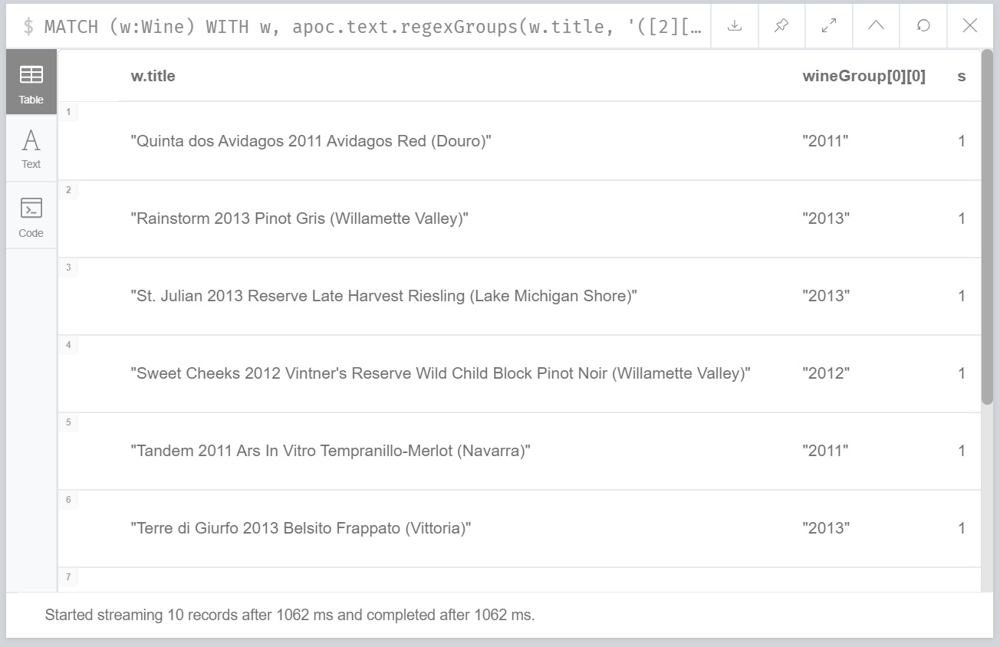

Also, we can now deal with the awkward 14 using `replace()`, now that we know what year to get rid of. Success!

Right, given we can successfully extract the years, it makes the most sense to do the years first, and then use those for determining the `WineGroup` nodes. 

Firstly, process all the `Wine` nodes that have a year:

* Create the `Year` node
* Connect the `Year` node to the `Wine` node
* Then use both to create the `WineGroup` node and connect up

----
//Create the Year nodes
CALL apoc.periodic.iterate(
  "MATCH (w:Wine) WITH w, apoc.text.regexGroups(w.title, '([2][0-1][0-1][0-9])|([1][9][7-9][0-9])') AS years WITH w, years, size(years) AS s WHERE s>0 RETURN years[0][0] as year",
  "MERGE (y:Year{value:year})",
  {batchSize:100, parallel:false});
----

----
//Connect Year node to Wine node
MATCH (w:Wine) 
WITH w, apoc.text.regexGroups(w.title, '([2][0-1][0-1][0-9])|([1][9][7-9][0-9])') AS years 
WITH w, years, size(years) AS s WHERE s>0
MATCH (y:Year {value:years[0][0]})
CREATE (w)-[:FROM_YEAR]->(y);
----

----
//Create the WineGroup nodes
MATCH (w:Wine)-[:FROM_YEAR]->(y:Year)
MERGE (wg:WineGroup {title:apoc.text.replace(w.title, y.value,'')})
WITH wg, w
CREATE (w)-[:IN_WINE_GROUP]->(wg);
----

*What about wines with no year?*

Interestingly, given how we deduplicated our data (assume all wine are unique, we do have the interesting question of whether it's worth creating a `WineGroup` node for those that don't have a valid year. I think we'll leave them for now, and we can revisit all of this if it turns out to be a wrong assumption!

*Finally, let's ask some questions!*

I'm so excited! We can now start to ask some questions around popular wine years, which wine groups have had successful years, and so forth. In this session we looked at the following:

* Which `Year` had the most `Wine`?
* Which `WineGroup` has the most `Year` nodes?
* Which `Winery` produces the most `Wine` for a given `Year`?

Let's have a look at the first query:

----
MATCH (w:Wine)-[:FROM_YEAR]->(y:Year)
WITH y, collect(w) AS wines
RETURN y.value, size(wines) AS s ORDER BY s DESC
----

image::img/img7.jpg[width="600"]

I've taken the liberty of turning the results into a chart (you can export CSV straight from Neo4j Browser, I've circled the button on the above image):

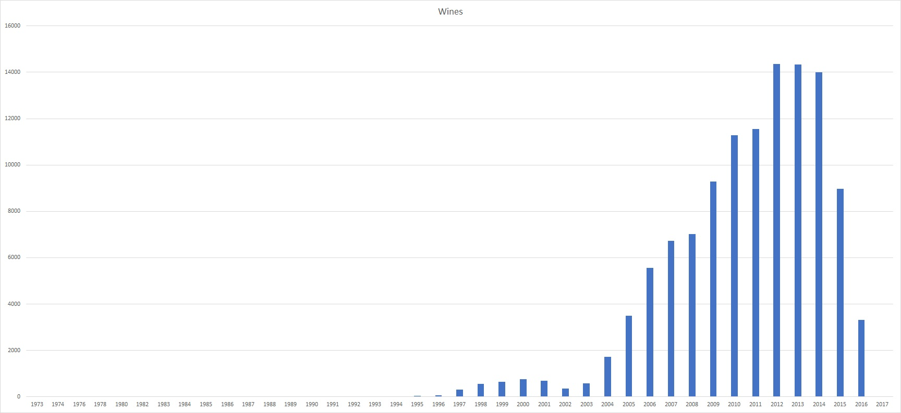

Neck and neck between 2012 and 2013! Very interesting, given our wine range goes up to 2017. I was not expecting that at all, more like 2014-15.

Onto the next query, let's look at the `WineGroup` with the most `Year` nodes:

----
MATCH (wg:WineGroup)<-[:IN_WINE_GROUP]-(w:Wine)-[:FROM_YEAR]->(y:Year)
WITH wg, collect(y.value) AS years
RETURN wg.title, years, SIZE(years) AS cy ORDER BY cy DESC
----

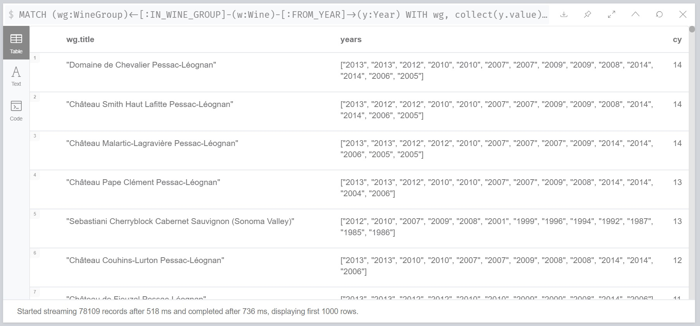

Double years? Hmm, let's go investigate:

----
MATCH (wg:WineGroup)<-[:IN_WINE_GROUP]-(w:Wine)-[:FROM_YEAR]->(y:Year)
WHERE id(wg)=576395
RETURN *
----

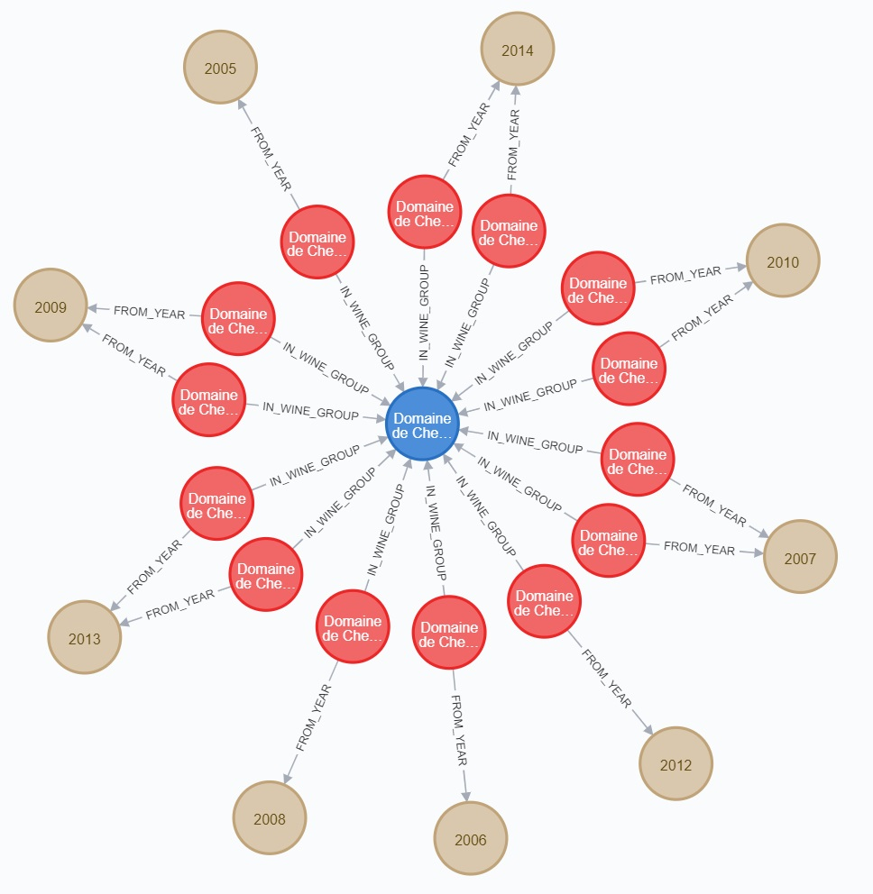

Ah - our assumption that each `Wine` we imported was unique was a false assumption! How big is the problem?

----
MATCH (wg:WineGroup)<-[:IN_WINE_GROUP]-(w:Wine)-[:FROM_YEAR]->(y:Year)
WITH wg, y, collect(w) AS wines WHERE size(wines)>1
RETURN count(wg)
----

Returns 471 - ok, not so bad. I'm feeling dangerous, let's try and fix it in a (questionable) query... I'm going to take the first wine in the collect, and remove the others remaining.

----
MATCH (wg:WineGroup)<-[:IN_WINE_GROUP]-(w:Wine)-[:FROM_YEAR]->(y:Year)
WITH wg, y, collect(w) AS wines WHERE size(wines)>1
WITH wines[1] AS w
DETACH DELETE w
----

Let's go into a little what the above query does. You'll probably remember doing something like `MATCH (n:MyNode) DETACH DELETE n` will match all nodes with label `MyNode`, detach any relationships and then delete all the nodes that have that label. What the above query does with the `WITH` statement is pull out the 2nd node from our collection (which we know is a duplicate), and then apply the same method. Hopefully that makes sense!

_(I cheated slightly, 2 of the 471 were in fact triplicates, so I ran the above query twice to remove those too)_

So now, if we run our query again for the `WineGroup` with the most `Year` nodes, we now get:

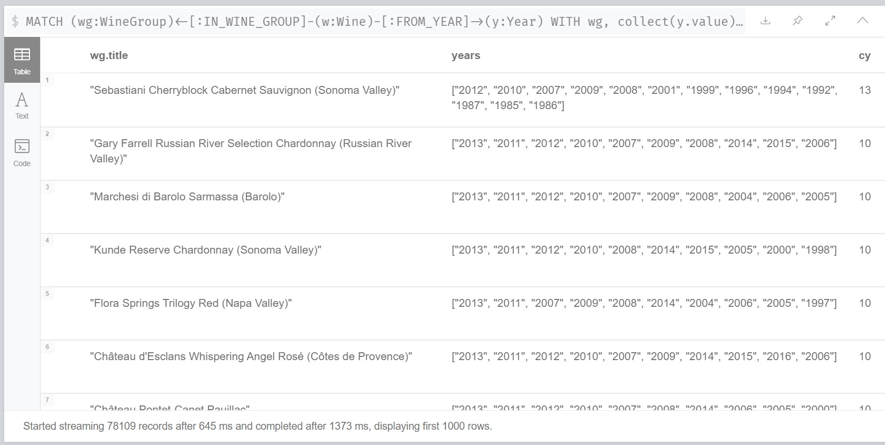

Success! On to the next query... Finding out the `Winery` with the most most `Wine` for a given `Year`. 

As before, we're using `Wine` and also `Year` as the method to connect things together. 

----
MATCH (wy:Winery)<-[:FROM_WINERY]-(w:Wine)-[:FROM_YEAR]->(y:Year)
WITH wy, y, COLLECT(w) AS wines
RETURN wy.name AS Winery, y.value AS Year, size(wines) AS `No of Wines` 
ORDER BY `No of Wines` DESC
----

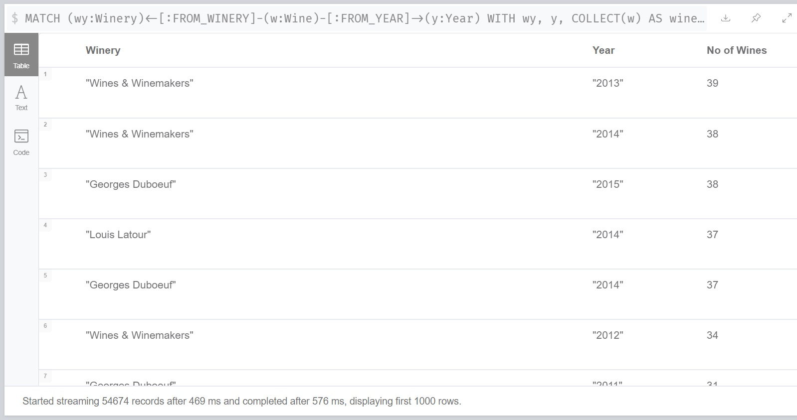

Very popular, that Wines & Winemakers. Perhaps we'll investigate a bit more at some point in the future.

[#week6]
=== Week 6 (3 July - 8am PDT, 11pm EDT, 4pm BST, 5pm CEST): So what exactly is designation?!

.by Scott Warman
[caption="Napa in a Bottle ",link=https://unsplash.com/photos/h4AGlo55tTA] 
image::https://images.unsplash.com/photo-1516594915697-87eb3b1c14ea?ixlib=rb-1.2.1&ixid=eyJhcHBfaWQiOjEyMDd9&auto=format&fit=crop&w=1650&q=80[width=640, align="center"] 

https://twitch.tv/neo4j_[Neo4j on Twitch!^]

_Want to participate?_

* _Download and install http://neo4j.com/download[Neo4j Desktop^]_
* _Create a new project in Neo4j Desktop called wine, and add a database. You may find https://neo4j.com/developer/neo4j-desktop/[this developer guide^] helpful_
* _Complete the steps for Weeks 1,2 and 5 to load the data_

Welcome back, everybody! Well, I have to say, lots of fun was had this week. 

So we set out to understand what exactly was `Designation`. We had a quick look, and it very much appeared like it was a generated data field, most likely from the wine title, and didn't seem particularly useful. So it was quickly discounted for now - and an thorough investigation into the original data set may be useful to do in the future.

So.. with all this time left for the session, it was time to decide what to do next! I was quite keen to have a play with `Variety`. When we looked at it last time (at the point of data import), we noticed there were wine grape varieties in the data, and there are lots of interesting queries we could do off the back of that, i.e. recommending different blends of wine, and so forth.

First of all, we had a look at the different varieties we had:

----
MATCH (v:Variety)
RETURN v.name ORDER BY v.name
----

Which lets us know we have 708 records for variety.

There are some interesting things going on, when we explore the list of varieties returned. For example: 

* different spellings for the same grape, e.g. Aragonez and Aragonês
* different names for the same grape, e.g. Syrah and Shiraz
* different ordering of wine blends, e.g. Cabernet-Shiraz and Shiraz-Cabernet

Ideally, we want to be able to clean these up, as well as being able to link up all wines that have a grape variety in common together, e.g.

----
MATCH (v:Variety)
WHERE tolower(v.name) CONTAINS 'shiraz'
RETURN v.name ORDER BY v.name
----

.We want all of these to link to Shiraz `Variety`!
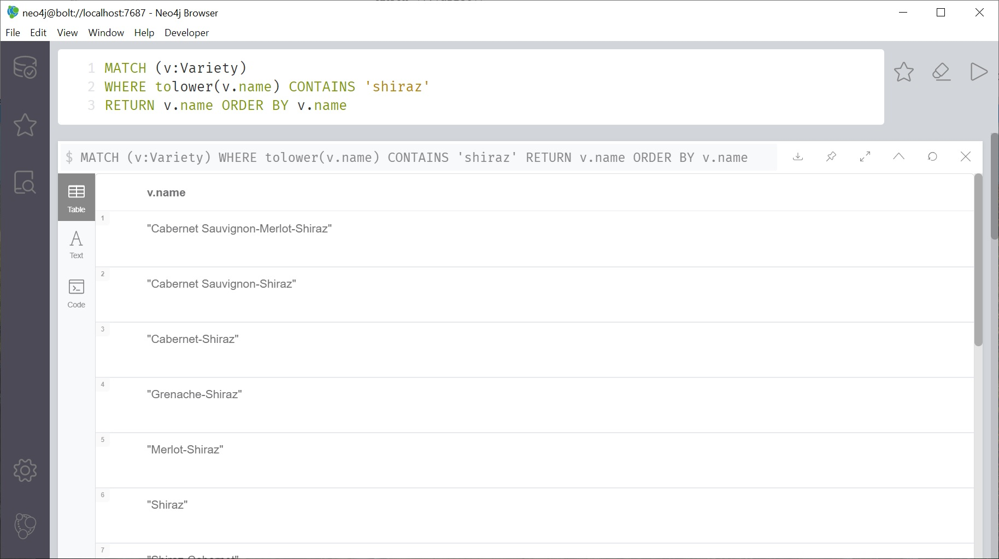

This problem that we tackled this week pretty much follows the same approach I used when working on food ingredients data. This problem comes up a lot, and you will see it in many places. If this is something of interest, I suggest you read my https://medium.com/neo4j/whats-cooking-part-5-dealing-with-duplicates-a6cdf525842a[BBC GoodFood blog post^] on it!

First of all, let's have a look at the similar names. Once again, we are going to use APOC for helping us do the text manipulation. Before we do major surgery on our data, let's do a bit of comparison work.

I've previously used both Levenstein similarity and Sorensen dice similarity for comparting text, each have their pros and cons. Where strings vary in size compared to each other, I am not a big fan of Levenstein distance - I find the value a bit meaningless as returning 3 might mean very little similarity between two words, but would suggest two paragraphs are nearly the same!

When picking your approach for comparing strings, do your homework, and be well aware of what the chosen algorithm is doing, so that you are not caught by surprise. You can look at the documentation for the various fuzzy text matching options in the https://neo4j.com/docs/labs/apoc/current/misc/text-functions/#text-functions-text-similarity[APOC documentation^].

Using Levenstein similarity (it returns us a value between 0-1) means we at least have two fixed points that we can apply a threshold to. Again, another warning, dear reader. When deciding what threshold value you decide to chose, beware the https://en.wikipedia.org/wiki/Overfitting[underfitting and overfitting^] problem! Even with something as simple as this, you can be caught unaware.

So, back to our comparitor query:

----
MATCH (v1:Variety), (v2:Variety)
WHERE ID(v1)<ID(v2)
WITH v1, v2, apoc.text.levenshteinSimilarity(v1.name, v2.name) as d 
RETURN v1.name, v2.name, d ORDER BY d DESC
----

image::img/img14.jpg[width="600"]

Nice! This is picking up the varieties with similar names. However, if we scroll down a bit... 

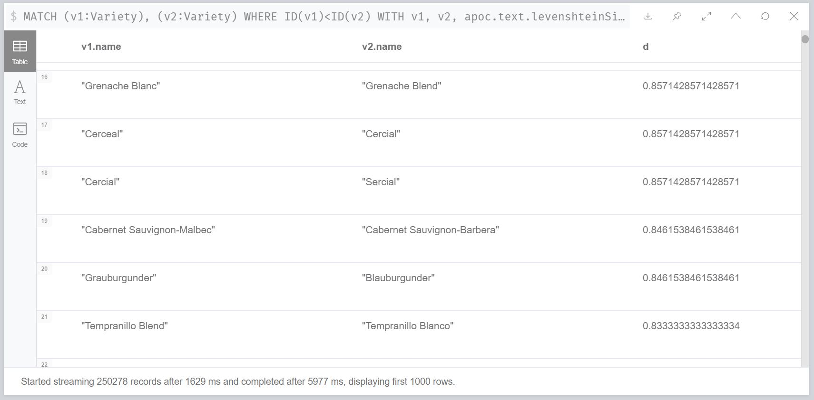 

Ah, we spot a couple of problems:

* What do we do about those barrel names? This doesn't help the ordering problem!
* The challenge with Levenstein similarity the longer the word gets, as long as lots of letters match, it's going to get a good similarity score. Blanco and Blend are going to be matched if they are part of a longer word.

Before we continue on how we're going to fix that, perhaps another thing to mention. It is highly unlikely we're going to be able to apply 'automated' means to process the data, and get a 100% result. Underfitting and overfitting aside, we're going to have to accept that what we do won't be completely right, but as long as it's 'good enough' (depending on what we define 'good enough'), then we are winning. For me, given this data set and what we're trying, getting a few wrong varieties joined together is completely fine, as long as the vast majority are correct.

Ok, enough of that, let's talk about how we're going to resolve the problems above in one, fell swoop. We are going to tokenise! Time to revamp that data model (again)...

We are going to create a new node label, `VarietyName`, and this will have the tokenised name(s) from `Variety`. For example, for 'Grenanche Blanc', there are going to be two new nodes created with the values 'Grenance' and 'Blanc', connecting back to 'Grenanche Blanc'. Like this, we do away with the ordering problem, and our words are now nice and short, so that similarity score is going to be more meainingful. Then we can do all the comparitor work on top. 

.Our latest update!
image::img/img16.jpg[width="600"] 

We are going to add our new node following these steps:

* Create an index for `VarietyName`
* Get all the variety names, split the strings by spaces and hyphens, apply a text cleaning function (to remove accents, etc.), and then `MERGE` them. Attach back to originating `Variety` node
* Go across and compare all the `VarietyName` nodes against each other, using Levenstein Similarity. Any names that match, reconnect the originating `Variety` node to one of the `VarietyName`, and delete the other one

Let's get that index sorted:

----
CREATE INDEX ON :VarietyName(name)
----

First pass - I'm using APOC again to do a multiple split:

----
MATCH (v:Variety)
WITH v, apoc.text.split(v.name, "[ ]|[-]") AS names
FOREACH (n IN names|
 MERGE (vn:VarietyName {name:apoc.text.clean(n)})
 MERGE (vn)-[:IS_COMPONENT_OF]->(v)
    )
----

And the second pass:

----
MATCH (v1:VarietyName), (v2:VarietyName)-[:IS_COMPONENT_OF]->(var:Variety)
WHERE ID(v1)<ID(v2)
WITH v1, v2, apoc.text.levenshteinSimilarity(v1.name, v2.name) as d WHERE d >= 0.8
MERGE (v1)-[:IS_COMPONENT_OF]->(var)
WITH v2
DETACH DELETE v2
----

We decided to live dangerously and a threshold of 0.8 seemed to do a good job. Remember, folks, if we were doing this for a more serious project, we'd be a bit more careful with how we chose the threshold.

How many `VarietyName` do we have?

image::img/img17.jpg[width="600"] 

Wow, that's a fair fewer than the original `Variety` node. 

There's probably a bunch of other things we can do to clean it up further, and we'll revisit that later. But for now, let's ask some new questions!

*Show `Variety` linked to `VarietyName`*

----
MATCH (vn:VarietyName)-[:IS_COMPONENT_OF]->(v:Variety)
WITH vn, COLLECT(v) AS var
RETURN vn.name, var, size(var) AS s 
ORDER BY s DESC LIMIT 5
----

image::img/img18.jpg[width="600"] 

*Which `VarietyName` have the most `Wine`?*

----
MATCH (vn:VarietyName)-[:IS_COMPONENT_OF]->(v:Variety)<-[:HAS_VARIETY]-(w:Wine)
WITH vn, COLLECT(w) AS wines
RETURN vn.name, size(wines) AS s 
ORDER BY s DESC LIMIT 5
----

image::img/img19.jpg[width="600"] 

Sooo, we'll probably need to use some knowledge to deal with those, but don't worry too much that things like 'blend' are popping up. What we will do very soon is use the `VarietyName` nodes to help use 'dedulicate' our `Variety` nodes, and the 'blend' problem will go away. More on that to come soon!

[#week7]
=== Week 7 (10 July - 8am PDT, 11pm EDT, 4pm BST, 5pm CEST): Time for some description fun!

.by Raissa Lara Lütolf
[caption="Selling rose wine ",link=https://unsplash.com/photos/lCIPZxZqXKY] 
image::https://images.unsplash.com/photo-1586864985444-ddd0ba84c323?ixlib=rb-1.2.1&ixid=eyJhcHBfaWQiOjEyMDd9&auto=format&fit=crop&w=2106&q=80[width=640, align="center"] 

https://twitch.tv/neo4j_[Neo4j on Twitch!^]

_Want to participate?_

* _Download and install http://neo4j.com/download[Neo4j Desktop^]_
* _Create a new project in Neo4j Desktop called wine, and add a database. You may find https://neo4j.com/developer/neo4j-desktop/[this developer guide^] helpful_
* _Complete the steps for Week 1 - 2,5-6 to load the data_

*All about the descriptions!*

So this week we had a look at the descriptions for the data. These are those notes you get about the wine, such as what does it taste of, smell of, etc. We hadn't previously imported those before, so this is the week to do it!

I am really excited about the descriptions, they give us yet another layer of data to explore that allow us to see how different wines are connected together. Perhaps we can use them to discover new grape varieties we might like, based on the wine's tasting notes. Or perhaps there's some specific about the soil in a vineyard that we like - many interesting things to look into!

We're going to use a similar process to what we did with the `Variety` nodes - tokenise the words. The difference here being that some of the descriptions are quite long - paragraphs long! There will be lots of words we'll want to get rid of, our, 'stop' words such as 'the, as, wine' and so forth. Our focus for now is to get that data in to begin with, and then we can start the clean up.

*Updates to the model*

As mentioned above, we haven't added `Description` to our data, and, as we'll be tokenising the description into words, we'll need to add a `DescriptionWord` as well. Let's take a look at the next model iteration:

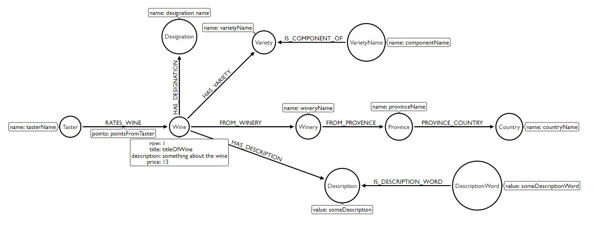 

Undoubtedly, we'll be doing a few more revisions in the future, so don't get too attached to that model!

*Let's load up the data*

As always, the first order of the day is set up an index. We don't need to do one for `Description`. It is highly unlikely we'll ever do a search directly on the description - we won't be `MERGE`-ing on it (we assume each description is unique, like the wine). However, we do need one for `DescriptionWord`. We'll be doing loads of querying on that, so let's get one set up:

----
CREATE INDEX ON :DescriptionWord(value)
----

Next, let's load up the data. I'm going to start with `Description`. This is slightly different to the Twitch stream, as I've altered the query so that we connect `Description` to `Wine` at the time of load:

----
:auto //add this line if you're using Neo4j Browser
USING PERIODIC COMMIT 1000
LOAD CSV WITH HEADERS FROM 'https://raw.githubusercontent.com/lju-lazarevic/wine/master/data/winemag-data-130k-v3.csv' AS row
CREATE (d:Description {value:coalesce(row.description, "No Description")})
WITH d, row
MATCH (w:Wine {id:row.id})
CREATE (w)-[:HAS_DESCRIPTION]->(d)
----

For those of you who were watching the stream, you will have spotted my error - I had put an index on `id`, and not `name`. That's why it was taking so long! I must remind myself to check the `:Schema` each time I think about adding data 😀. This took less than 12s, again that's what I'd expect. If it takes a long time, check those indexes/queries where you assume an index is being used.

Ok, let's tokenise those description words! We're going to use `apoc.periodic.iterate()` to help us

----
//Create the Description Word nodes
CALL apoc.periodic.iterate(
  "MATCH (d:Description) RETURN d",
  "WITH d, split(d.value, ' ') AS words
FOREACH (n IN words|
 MERGE (dw:DescriptionWord {value: lower(n)})
 MERGE (dw)-[:IS_DESCRIPTION_WORD]->(d)
    )",
  {batchSize:100, parallel:false})
----

We did an initial creation of the words splitting with space, but we quickly discovered that there are other things, such as slashes, hyphens, etc, we need to include as well as spaces for splitting. We also have other characters such as commas causing mischief. So, let's have another go at loading the words to account for this. The quickest way will be to delete all the `DescriptionWord` nodes, and start again... Note that we have 71135 `DescriptionWord` nodes...

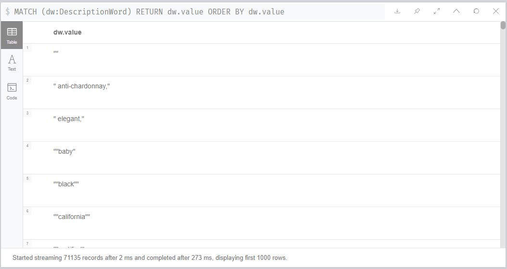 

----
//Delete the DescriptionWord nodes
call apoc.periodic.commit(
"match (dw:DescriptionWord)
WITH dw LIMIT {limit}
DETACH DELETE dw
RETURN count(*)", {limit:100})
----

You may be wondering why is `limit` set so low? Don't forget that we've got some very densely connected `DescriptionWord` nodes, so we'll want to keep the limit low as they might be connected to 80k+ wines!

Ok, let's load those nodes back in. We'll also use 'apoc.text.clean()' to strip out commas, accents, and the like:

----
CALL apoc.periodic.iterate(
  "MATCH (d:Description) RETURN d",
  "WITH d, apoc.text.split(d.value, '[ ]|[-]|[/]') AS words
FOREACH (n IN words|
 MERGE (dw:DescriptionWord {value: apoc.text.clean(n)})
 MERGE (dw)-[:IS_DESCRIPTION_WORD]->(d)
    )",
  {batchSize:100, parallel:false})
----

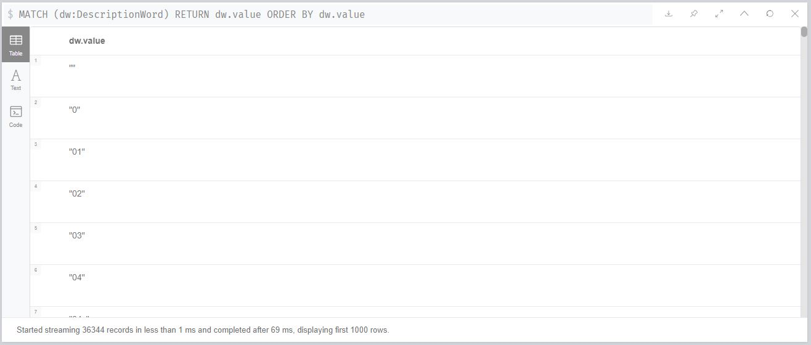 

Much better! Down to 36344 nodes... but we have lots of numbers... How many do we have?

----
MATCH (d:DescriptionWord)
WHERE size(apoc.text.replace(d.value,"[0-9]", ""))=0
RETURN count(d)
----

956... Ok - that's for `DescriptionWord` nodes with just numbers, do we have any that have letters and numbers?

----
MATCH (d:DescriptionWord)
WITH size(apoc.text.replace(d.value,"[0-9]", "")) as hasNum, d 
WHERE hasNum < size(d.value) AND hasNum >0
RETURN d.value
----

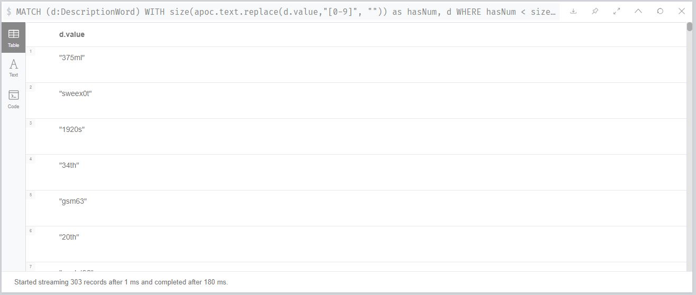

I think it's safe to say we can get rid of all of those, so let's do that now:

----
MATCH (d:DescriptionWord)
WHERE size(apoc.text.replace(d.value,"[0-9]", ""))<size(d.value)
DETACH DELETE d
----

And we're down to 35086 `DescriptionWord` nodes, far less than originally! We'll still have to deal with plurals and the sort - but let's leave that for next week.

So, what are the most commonly used `DescriptionWord` values? I'm going to guess there are a lot of stop words taking pole position...

----
MATCH (dw:DescriptionWord)-[:IS_DESCRIPTION_WORD]->(d:Description)
WITH dw, COLLECT(d) AS descriptions
RETURN dw.value, size(descriptions) as size ORDER BY size DESC
----

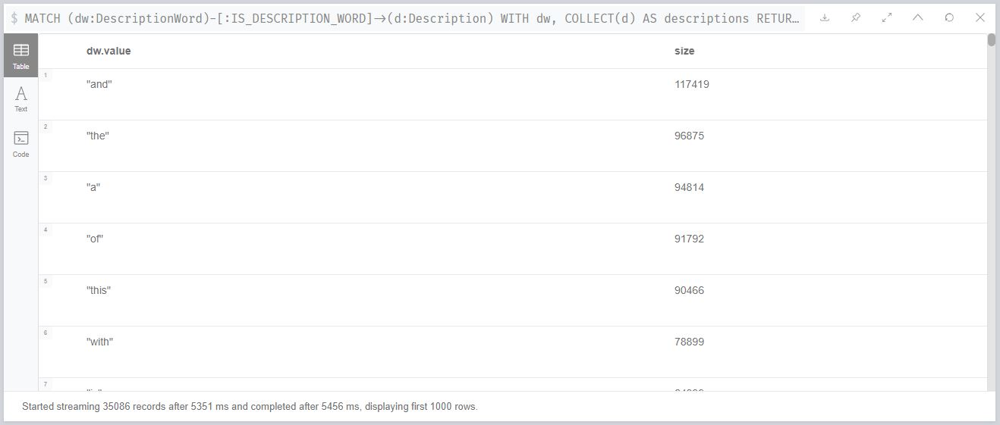

We'll have a look at those next week!

We then finished off the week looking at the similarity of the words. We quickly discovered we needed to do a fair bit of throttling on the words so that relevant words were compared together, e.g.

----
MATCH (d1:DescriptionWord), (d2:DescriptionWord)
WHERE id(d1)<id(d2) AND size(d1.value) > 7 AND size(d1.value) <10 AND size(d2.value) > 7 AND size(d2.value) <10 AND left(d1.value,1)=left(d2.value,1)
WITH d1, d2, apoc.text.levenshteinSimilarity(d1.value, d2.value) as res
RETURN d1.value, d2.value, res ORDER BY res DESC
----

To try and make sure we are comparing similar words to begin with, we are:

* Making sure that the words are within 2-3 characters in length of each other
* Making sure they start with the same letter

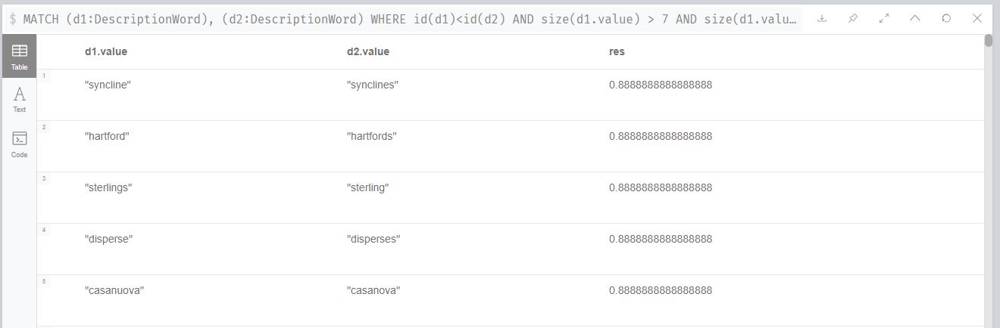

We can see we have some very interesting things to deal with. Along with plurals, we also have spelling mistakes. Again, another one we'll take a closer look at next week. Should be fun!

week 8 ideas
- get rid of some stop words
- compare tasting nodes to same wine group, any new stuff appear?
- how often does the grape variety appear in the description?

[#week8]
=== Week 5 (17 July - 8am PDT, 11am EDT, 4pm BST, 5pm CEST, 8:30pm IST): Let's do more with descriptions!

.by Nick Karvounis
[caption="Nimb Brasserie, København, Denmark  ",link=https://unsplash.com/photos/SWIoVDRZWUY] 
image::https://images.unsplash.com/photo-1521153144914-aae4bcd3d201?ixlib=rb-1.2.1[width=640, align="center"] 

https://twitch.tv/neo4j_[Neo4j on Twitch!^]

_Want to participate?_

* _Download and install http://neo4j.com/download[Neo4j Desktop^]_
* _Create a new project in Neo4j Desktop called wine, and add a database. You may find https://neo4j.com/developer/neo4j-desktop/[this developer guide^] helpful_
* _Complete the steps for Week 1 - 2, 5-7 to load the data_

*The plan*

So I'm thinking:

* Get rid of the stop words
* Deal with plurals and and spelling mistakes
* Let's do some exploration of wines and descriptions!